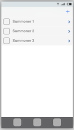

# LoLStats Specification

## Design Overview

The root view controller for LoLStats will be a UITabBarController with three
tabs: Search, Watch List, and Compare. Search searches for a summoner by name,
Watch List displays the user's watch list, and Compare compares the stats of two
or more summoners. LoLStats makes use of the
[Riot Games API](https://developer.riotgames.com). The full API reference can be
found at
[https://developer.riotgames.com/api/methods](https://developer.riotgames.com/api/methods).

## Search

Upon first opening LoLStats, the user is presented with the first tab,
Search. The user can enter a summoner name to search for. If the summoner name
exists, a summoner detail screen is displayed with an overview of the summoner's
basic stats and a list of his/her recent games.

Tapping any of the recent games will pull up the details of that match. The
summoner's champion and his stats in the game will be displayed at the top of
the screen. The other summoners and the champions that they used in the game
will be displayed in a table below. Tapping any of the summoners will display
that summoner's detail page as described above.

The search screen also lists recent search results below the search bar. Tapping
any of the recent results will display the summoner's detail page.

## Watch List

The second tab is the Watch List, a list of summoners that the user is keeping
track of. Tapping any of the entries in the Watch List will display that
summoner's detail page. The user can also add summoners to his Watch List by
tapping the add button in the top right corner.

## Compare

The final tab is Compare, which provides the user with the ability to compare
the stats of two summoners. The user can enter the names of the summoners, and
if the summoners both exist, a comparison detail screen will be displayed
containing charts, graphs, and visualizations of how the two entered summoners
compare.

